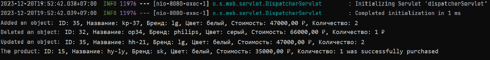

# Разработка корпоративных информационных систем. Практическая работа 8
Варинат 6: Холодильник.

Изменить практическую работу №7, добавив следующие возможности:

- Настроить очередь (Для ActiveMQ или любого другого брокера сообщений JMS) приема сообщений для администратора;
- При выполнении операций добавления, удаления или редактирования ресурса через REST API / форму создавать
  соответствующие уведомления и отправлять их в очередь;
- Любым удобным способом (можно через терминал) продемонстрировать извлечение административных сообщений о выполненных
  операциях (из п.2);
- Добавить кнопку-ссылку «купить» на форме. После этого в брокере сообщений отправляется сообщение о том, какой
  «товар»/сущность хочет купить пользователь;
- В п.4 "товар" помечается как купленный и не будет показан в общем списке товаров. 
Необходимо добавить соответствующий столбец, или просто удалить запись о купленном товаре из БД, но перед этим не 
забыть отправить информацию о товаре в брокер сообщений.

## Описание

Добавлен функционал покупки товара. После покупки количество товара уменьшается на единицу, как только количество товаров достигент 0, товар будет удалён из БД.
Сообщения о добавлении, изменении, удалении и покупке холодильников выводятся в консоль. Данный функционал реализован только для запросов, обрабатываемых WEB контроллером. Примеры сообщений показаны ниже.




## Инструкция по сборке и запуску Java-проекта из командной строки
### 1. Установите PostgreSQL:

Убедитесь, что на Вашем компьютере установлен [PostgreSQL](https://www.postgresql.org/download/)
Для установки PostgreSQL на Linux Ubuntu / Debian, можно воспользоваться менеджером пакетов:

```
sudo apt-get update
sudo apt-get install postgresql postgresql-contrib
```

### 2. Инициализация базы данных:

Перейдите в директорию server и запустите скрипт ```init.sql``` с помощью следующей команды:

```
psql -U postgres -h localhost -f init.sql
```

В этом скрипте cоздается и наполняется данными таблица clothes

## Инструкция по сборке и запуску Java-проекта из командной строки

### 1. Установите JDK и Maven:

Убедитесь, что на Вашем компьютере установлены JDK, Maven ActiveMQ. 
Вы можете проверить это, выполнив команды

```
java -version
mvn -version
activemq start
```

### 2. Компиляция и запуск:

```
mvn package
```

Из папки target:

```
java -jar target/server-0.0.1-SNAPSHOT.jar
```

